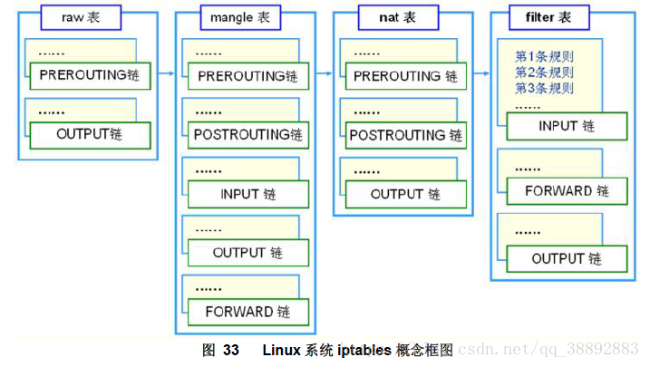
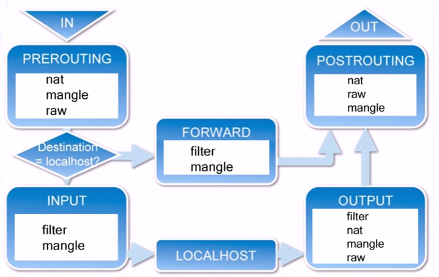

# iptables 详解

防火墙，其实说白了讲，就是用于实现Linux下访问控制的功能的，它分为硬件的或者软件的防火墙两种。无论是在哪个网络中，防火墙工作的地方一定是在网络的边缘。而我们的任务就是需要去定义到底防火墙如何工作，这就是防火墙的策略，规则，以达到让它对出入网络的IP、数据进行检测。

目前市面上比较常见的有3、4层的防火墙，叫网络层的防火墙，还有7层的防火墙，其实是代理层的网关。

对于TCP/IP的七层模型来讲，我们知道第三层是网络层，三层的防火墙会在这层对源地址和目标地址进行检测。但是对于七层的防火墙，不管你源端口或者目标端口，源地址或者目标地址是什么，都将对你所有的东西进行检查。所以，对于设计原理来讲，七层防火墙更加安全，但是这却带来了效率更低。所以市面上通常的防火墙方案，都是两者结合的。而又由于我们都需要从防火墙所控制的这个口来访问，所以防火墙的工作效率就成了用户能够访问数据多少的一个最重要的控制，配置的不好甚至有可能成为流量的瓶颈。

### 历史以及工作原理



### 1. iptables的发展:

iptables的前身叫ipfirewall （内核1.x时代）,这是一个作者从freeBSD上移植过来的，能够工作在内核当中的，对数据包进行检测的一款简易访问控制工具。但是ipfirewall工作功能极其有限\(它需要将所有的规则都放进内核当中，这样规则才能够运行起来，而放进内核，这个做法一般是极其困难的\)。当内核发展到2.x系列的时候，软件更名为ipchains，它可以定义多条规则，将他们串起来，共同发挥作用，而现在，它叫做iptables，可以将规则组成一个列表，实现绝对详细的访问控制功能。

他们都是工作在用户空间中，定义规则的工具，本身并不算是防火墙。它们定义的规则，可以让在内核空间当中的netfilter来读取，并且实现让防火墙工作。而放入内核的地方必须要是特定的位置，必须是tcp/ip的协议栈经过的地方。而这个tcp/ip协议栈必须经过的地方，可以实现读取规则的地方就叫做 netfilter.\(网络过滤器\)

作者一共在内核空间中选择了5个位置;

1. 内核空间中：从一个网络接口进来，到另一个网络接口去的
2. 数据包从内核流入用户空间的
3. 数据包从用户空间流出的
4. 进入/离开本机的外网接口
5. 进入/离开本机的内网接口

### 2.iptables的工作机制

从上面的发展我们知道了作者选择了5个位置，来作为控制的地方，但是你有没有发现，其实前三个位置已经基本上能将路径彻底封锁了，但是为什么已经在进出的口设置了关卡之后还要在内部卡呢？ 由于数据包尚未进行路由决策，还不知道数据要走向哪里，所以在进出口是没办法实现数据过滤的。所以要在内核空间里设置转发的关卡，进入用户空间的关卡，从用户空间出去的关卡。那么，既然他们没什么用，那我们为什么还要放置他们呢？因为我们在做NAT和DNAT的时候，目标地址转换必须在路由之前转换。所以我们必须在外网而后内网的接口处进行设置关卡。

这五个位置也被称为五个钩子函数（hook functions）,也叫五个规则链。

1. PREROUTING \(路由前\)
2. INPUT \(数据包流入口\)
3. FORWARD \(转发管卡\)
4. OUTPUT\(数据包出口\)
5. POSTROUTING（路由后）

这是NetFilter规定的五个规则链，任何一个数据包，只要经过本机，必将经过这五个链中的其中一个链。

#### 数据流走向



1. 一个数据包进入网卡时，它首先进入PREROUTING链，内核根据数据包目的IP判断是否需要转发出去。
2. 如果数据包就是进入本机的，它就会沿着图向下移动，到达INPUT链。数据包到了INPUT链后，任何进程都会收到它。本机上运行的程序可以发送数据包，这些数据包会经 过OUTPUT链，然后到达POSTROUTING链输出。
3. 如果数据包是要转发出去的，且内核允许转发，数据包就会如图所示向右移动，经过 FORWARD链，然后到达POSTROUTING链输出。

#### 规则、表和链

**1.规则（rules）**

规则（rules）其实就是网络管理员预定义的条件，规则一般的定义为“如果数据包头符合这样的条件，就这样处理这个数据包”。规则存储在内核空间的信息包过滤表中，这些规则分别指定了源地址、目的地址、传输协议（如TCP、UDP、ICMP）和服务类型（如HTTP、FTP和SMTP）等。当数据包与规则匹配时，iptables就根据规则所定义的方法来处理这些数据包，如放行（accept）、拒绝（reject）和丢弃（drop）等。配置防火墙的主要工作就是添加、修改和删除这些规则。

**2.链（chains）**

链（chains）是数据包传播的路径，每一条链其实就是众多规则中的一个检查清单，每一条链中可以有一条或数条规则。当一个数据包到达一个链时，iptables就会从链中第一条规则开始检查，看该数据包是否满足规则所定义的条件。如果满足，系统就会根据该条规则所定义的方法处理该数据包；否则iptables将继续检查下一条规则，如果该数据包不符合链中任一条规则，iptables就会根据该链预先定义的默认策略来处理数据包。

**3.表（tables）**

表（tables）提供特定的功能，iptables内置了4个表，即raw表、filter表、nat表和mangle表，分别用于实现包过滤，网络地址转换和包重构的功能。

* RAW表：只使用在PREROUTING链和OUTPUT链上,因为优先级最高，从而可以对收到的数据包在连接跟踪前进行处理。一但用户使用了RAW表,在 某个链上,RAW表处理完后,将跳过NAT表和 ip\_conntrack处理,即不再做地址转换和数据包的链接跟踪处理了.

* filter表：主要用于过滤数据包，该表根据系统管理员预定义的一组规则过滤符合条件的数据包。对于防火墙而言，主要利用在filter表中指定的规则来实现对数据包的过滤。Filter表是默认的表，如果没有指定哪个表，iptables 就默认使用filter表来执行所有命令，filter表包含了INPUT链（处理进入的数据包），RORWARD链（处理转发的数据包），OUTPUT链（处理本地生成的数据包）在filter表中只能允许对数据包进行接受，丢弃的操作，而无法对数据包进行更改

* nat表：主要用于网络地址转换NAT，该表可以实现一对一，一对多，多对多等NAT 工作，iptables就是使用该表实现共享上网的，NAT表包含了PREROUTING链（修改即将到来的数据包），POSTROUTING链（修改即将出去的数据包），OUTPUT链（修改路由之前本地生成的数据包）

* mangle表：主要用于对指定数据包进行更改，在内核版本2.4.18 后的linux版本中该表包含的链为：INPUT链（处理进入的数据包），RORWARD链（处理转发的数据包），OUTPUT链（处理本地生成的数据包）POSTROUTING链（修改即将出去的数据包），PREROUTING链（修改即将到来的数据包）

#### 规则表之间的优先顺序

**Raw——&gt;mangle——&gt;nat——&gt;filter**

#### 规则链之间的优先顺序

**第一种情况：入站数据流向**

从外界到达防火墙的数据包，先被PREROUTING规则链处理（是否修改数据包地址等），之后会进行路由选择（判断该数据包应该发往何处），如果数据包 的目标主机是防火墙本机（比如说Internet用户访问防火墙主机中的web服务器的数据包），那么内核将其传给INPUT链进行处理（决定是否允许通 过等），通过以后再交给系统上层的应用程序（比如Apache服务器）进行响应。

**第二冲情况：转发数据流向**

来自外界的数据包到达防火墙后，首先被PREROUTING规则链处理，之后会进行路由选择，如果数据包的目标地址是其它外部地址（比如局域网用户通过网 关访问QQ站点的数据包），则内核将其传递给FORWARD链进行处理（是否转发或拦截），然后再交给POSTROUTING规则链（是否修改数据包的地 址等）进行处理。

**第三种情况：出站数据流向**

防火墙本机向外部地址发送的数据包（比如在防火墙主机中测试公网DNS服务器时），首先被OUTPUT规则链处理，之后进行路由选择，然后传递给POSTROUTING规则链（是否修改数据包的地址等）进行处理。

### 3.iptables命令说明

iptables的命令格式较为复杂，一般的格式如下：

```
iptables [-t 表] -命令 匹配   操作
```

**-t 表**

表选项用于指定命令应用于哪个iptables内置表。

**命令**

命令选项用于指定iptables的执行方式，包括插入规则，删除规则和添加规则，如下表所示

```
-P  --policy        <链名>  定义默认策略
-L  --list          <链名>  查看iptables规则列表
-A  --append        <链名>  在规则列表的最后增加1条规则
-I  --insert        <链名>  在指定的位置插入1条规则
-D  --delete        <链名>  从规则列表中删除1条规则
-R  --replace       <链名>  替换规则列表中的某条规则
-F  --flush         <链名>  删除表中所有规则
-Z  --zero          <链名>  将表中数据包计数器和流量计数器归零
-X  --delete-chain  <链名>  删除自定义链
-v  --verbose       <链名>  与-L他命令一起使用显示更多更详细的信息
```

**匹配规则**

匹配选项指定数据包与规则匹配所具有的特征，包括源地址，目的地址，传输协议和端口号，如下表所示

```
-i --in-interface    网络接口名>     指定数据包从哪个网络接口进入，
-o --out-interface   网络接口名>     指定数据包从哪个网络接口输出
-p ---proto          协议类型        指定数据包匹配的协议，如TCP、UDP和ICMP等
-s --source          源地址或子网>   指定数据包匹配的源地址
   --sport           源端口号>       指定数据包匹配的源端口号
   --dport           目的端口号>     指定数据包匹配的目的端口号
-m --match           匹配的模块      指定数据包规则所使用的过滤模块
```

**动作**

前面我们说过iptables处理动作除了 ACCEPT、REJECT、DROP、REDIRECT 、MASQUERADE 以外，还多出 LOG、ULOG、DNAT、RETURN、TOS、SNAT、MIRROR、QUEUE、TTL、MARK等。我们只说明其中最常用的动作：

* REJECT 拦阻该数据包，并返回数据包通知对方，可以返回的数据包有几个选择：ICMP port-unreachable、ICMP echo-reply 或是tcp-reset（这个数据包包会要求对方关闭联机），进行完此处理动作后，将不再比对其它规则，直接中断过滤程序。范例如下：

```
iptables -A  INPUT -p TCP --dport 22 -j REJECT --reject-with ICMP echo-reply
```

* DROP 丢弃数据包不予处理，进行完此处理动作后，将不再比对其它规则，直接中断过滤程序。

* REDIRECT 将封包重新导向到另一个端口（PNAT），进行完此处理动作后，将会继续比对其它规则。这个功能可以用来实作透明代理 或用来保护web 服务器。例如：

```
iptables -t nat -A PREROUTING -p tcp --dport 80 -j REDIRECT--to-ports 8081
```

* MASQUERADE 改写封包来源IP为防火墙的IP，可以指定port 对应的范围，进行完此处理动作后，直接跳往下一个规则链（mangle:postrouting）。这个功能与 SNAT 略有不同，当进行IP 伪装时，不需指定要伪装成哪个 IP，IP 会从网卡直接读取，当使用拨接连线时，IP 通常是由 ISP 公司的 DHCP服务器指派的，这个时候 MASQUERADE 特别有用。范例如下：

```
iptables -t nat -A POSTROUTING -p TCP -j MASQUERADE --to-ports 21000-31000
```

* LOG 将数据包相关信息纪录在 /var/log 中，详细位置请查阅 /etc/syslog.conf 配置文件，进行完此处理动作后，将会继续比对其它规则。例如：

```
iptables -A INPUT -p tcp -j LOG --log-prefix "input packet"
```

* SNAT 改写封包来源 IP 为某特定 IP 或 IP 范围，可以指定 port 对应的范围，进行完此处理动作后，将直接跳往下一个规则炼（mangle:postrouting）。范例如下：

```
iptables -t nat -A POSTROUTING -p tcp-o eth0 -j SNAT --to-source 192.168.10.15-192.168.10.160:2100-3200
```

* DNAT 改写数据包包目的地 IP 为某特定 IP 或 IP 范围，可以指定 port 对应的范围，进行完此处理动作后，将会直接跳往下一个规则链（filter:input 或 filter:forward）。范例如下：

```
iptables -t nat -A PREROUTING -p tcp -d 15.45.23.67 --dport 80 -j DNAT --to-destination 192.168.10.1-192.168.10.10:80-100
```

* MIRROR 镜像数据包，也就是将来源 IP与目的地IP对调后，将数据包返回，进行完此处理动作后，将会中断过滤程序。

* QUEUE 中断过滤程序，将封包放入队列，交给其它程序处理。透过自行开发的处理程序，可以进行其它应用，例如：计算联机费用等。

* RETURN 结束在目前规则链中的过滤程序，返回主规则链继续过滤，如果把自订规则炼看成是一个子程序，那么这个动作，就相当于提早结束子程序并返回到主程序中。

* MARK 将封包标上某个代号，以便提供作为后续过滤的条件判断依据，进行完此处理动作后，将会继续比对其它规则。范例如下：

```
iptables -t mangle -A PREROUTING -p tcp --dport 22 -j MARK --set-mark 22
```

### 4.常用示例

**查看防火墙的状态**

```
iptables -L -n -v --line-numbers
```

**启动/停止/重启防火墙**

```
service iptables stop
service iptables start
service iptables restart
```

**删除一条规则**

```
iptables -L INPUT -n --line-numbers
iptables -L OUTPUT -n --line-numbers
iptables -L OUTPUT -n --line-numbers | less
iptables -L OUTPUT -n --line-numbers | grep 202.54.1.1
```

**插入一条规则**

```
iptables -I INPUT 2 -s 202.54.1.2 -j DROP
```

**保存防火墙规则**

```
service iptables save
```

**加载防火墙规则**

```
iptables-restore < /root/my.active.firewall.rules
```

**删除公共接口上的私有地址**

```
iptables -A INPUT -i eth1 -s 192.168.0.0/24 -j DROP
iptables -A INPUT -i eth1 -s 10.0.0.0/8 -j DROP
```

**屏蔽 ip 地址**

```
iptables -A INPUT -s 1.2.3.4 -j DROP
iptables -A INPUT -s 192.168.0.0/24 -j DROP
```

**屏蔽入站端口**

```
iptables -A INPUT -p tcp -s 1.2.3.4 --dport 80 -j DROP
iptables -A INPUT -i eth1 -p tcp -s 192.168.1.0/24 --dport 80 -j DROP
```

**屏蔽出站ip**

```
iptables -A OUTPUT -d 192.168.1.0/24 -j DROP
iptables -A OUTPUT -o eth1 -d 192.168.1.0/24 -j DROP
```

**记录并删除包**

```
iptables -A INPUT -i eth1 -s 10.0.0.0/8 -j LOG --log-prefix "IP_SPOOF A: "
iptables -A INPUT -i eth1 -s 10.0.0.0/8 -j DROP
```

**通过 mac 地址过滤数据**

```
iptables -A INPUT -m mac --mac-source 00:0F:EA:91:04:08 -j DROP
```

只接收MAC地址为00:0F:EA:91:04:07的TCP流量

```
iptables -A INPUT -p tcp --destination-port 22 -m mac --mac-source 00:0F:EA:91:04:07 -j ACCEPT
```

**过滤 ICMP ping 请求**

```
iptables -A INPUT -p icmp --icmp-type echo-request -j DROP
iptables -A INPUT -i eth1 -p icmp --icmp-type echo-request -j DROP
```

**开启范围端口**

```
iptables -A INPUT -m state --state NEW -m tcp -p tcp --dport 7000:7010 -j ACCEPT
```

**开启范围 ip**

```
iptables -A INPUT -p tcp --destination-port 80 -m iprange --src-range 192.168.1.100-192.168.1.200 -j ACCEPT
```

**删除规则**

如果想要删除一条规则，那么可以直接使用序号，例如 INPUT 的第 4 条可以直接这么删除

```
iptables -D INPUT 4
```


